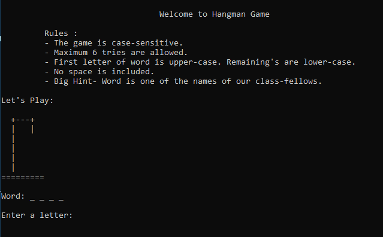
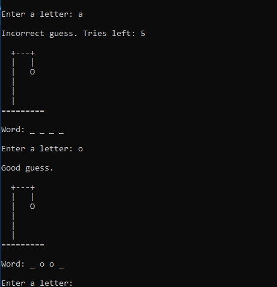
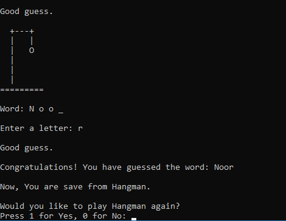
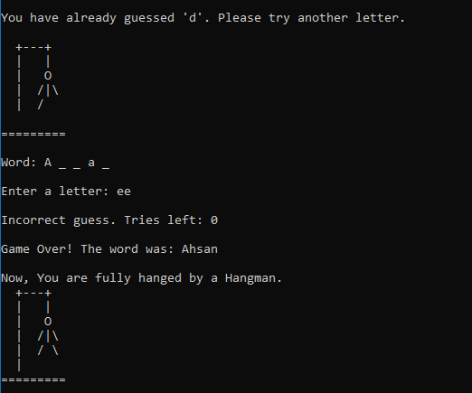

# Hangman Game

A console-based Hangman game implemented in C, focusing on control flow, string handling, and user interaction. Best for early semester project.

##  Gameplay Overview
- The player guesses a hidden word letter by letter
- A limited number of incorrect guesses are allowed
- The game visually displays the Hangman stages
- The game ends when the word is guessed or attempts run out

## Gameplay Preview

### Game Start


### Gameplay


### Win Screen


### Lose Screen



## How to Build
```bash
gcc src/hangman.c -o hangman
```

## Concepts Used
- Loops and conditionals
- Arrays and strings
- Modular programming with functions
- Dynamic memory allocation
- Input validation

## Future Improvements
- Load words from an external file
- Difficulty levels
- Better UI / ASCII art
- Cross-platform support

## Author
Hammad Qaiser

If you like this project, feel free to explore the repository or suggest improvements.
